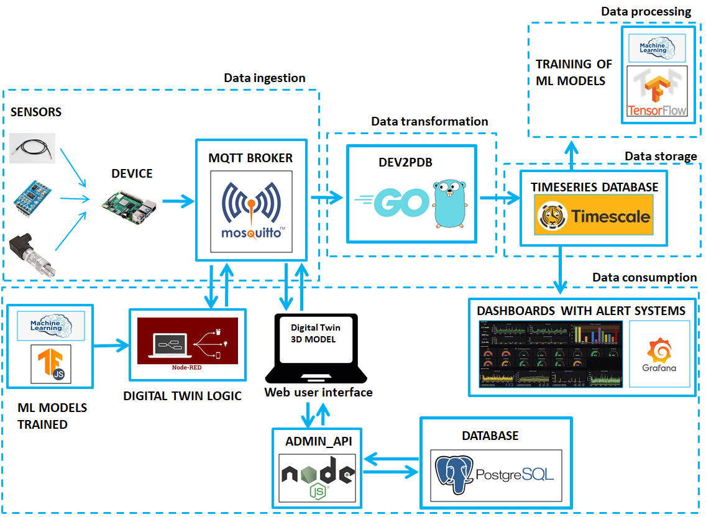
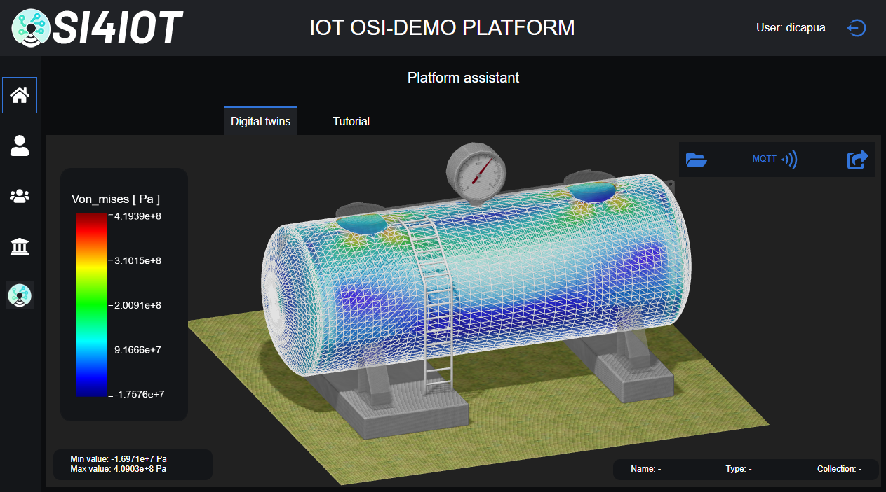
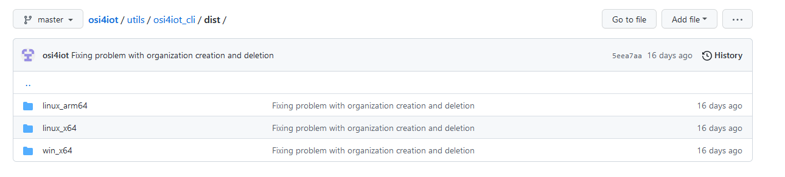

# Open Source Integration for Internet Of Things (OSI4IOT)


[](https://www.docker.com/)
[](https://web.telegram.org/k/)
[](https://github.com/eclipse/mosquitto)
[](https://github.com/node-red/node-red)
[](https://www.postgresql.org/)
[](https://www.timescale.com/)
[](https://www.pgadmin.org/)
[](https://grafana.com/)
[](https://doc.traefik.io/traefik/)
[](https://min.io/)
[](https://www.portainer.io/)
[](https://github.com/acassen/keepalived)

<!--  -->

Open Source Integration for Internet Of Things (IoT) is a framework that facilitates the integration of open-source software and hardware in IoT devices.

## Description

This repository contains implementation of Open Source Integration for IoT devices. The OSI model is a framework that describes how different open-source software and hardware components can be integrated in IoT devices. By understanding and applying the OSI model, developers can build robust, flexible and cost-effective IoT systems.



## Table of contents
- [About](#about)
- [Quick Start](#quick_start)
- [Getting Started](#getting_started)
- [Instalation](#instalation)
- [Other instructions, Specifications, Attributes or Project Info](#other_instructions,_Specifications,_Attributes,_or_Project_Info)
- [Usage](#usage)
- [Contributing](#contributing)
- [License](#license)
- [Test](#test)
- [Example](#example)
## About
The OSI4IOT platform has been developed to give answer to all the elements required in the Shipyard 4.0 strategy. The OSI4IOT name stand for "Open Source Integration For Internet of Thing". This project continues in development and can be download from the web address: https://github.com/osi4iot/osi4iot.

## Status


- [x] Mqqt 
- [x] Digital twin model
- [x] Dashboard
- [ ] Machine Learning 


## Quickstart (For The Impatient)

## Getting Started


### Requirements

In order to have the OSI4IOT platform running correctly, the following requirements must be met:
-	Installation of Docker in the Operative System (OS). Please read: [](./docs/docker.md).
-	Creation of a Telegram Bot for notification. Please read: [](./docs/telegram.md).
    -	Obtain the Telegram bot token.
    -	Obtain the group ID of the Telegram group for the main organization's default group.
    -	Obtain the Telegram invitation link for the main organization's default group.
-	Have a domain name to access the platform through a webpage.
-	Have an email address to send notifications from the platform. The password for this email is also required.

## Installation

To install the osi4iot package from Github, use the following command:
```
git clone https://github.com/osi4iot/osi4iot
cd osi4iot
```

The Command Line Interface (CLI) can be installed by running the appropriate script inside the `osi4iot` repository.

>./utils/osi4iot_cli/dist/

<details>
<summary>Distribution information</summary>
<p>




The folders for installation found in the subfolder indicate the type of operative system and architecture. The following table contains a summary:

| **Operative System** | **Architecture** | **Installer Folder** |
| -------------------- | ---------------- | -------------------- |
| **Windows**          | AMD (x64)        | win_x64              |
| **Linux**            | AMD (x64)        | linux_x64            |
| **Linux**            | ARM (arm64)      | linux_arm64          |
| **Mac**              | AMD (x64)        | linux_x64            |

The ARM architecture in Linux is specially build for low consuming microprocessors such as Raspberry Pi or similar. These types of microprocessors are very common in the building of any IOT infrastructure.

</p>
</details>

<details>
<summary>CLI installation</summary>
<p>


To proceed with the installation, download the appropriate installer for your system and run it in the terminal. For example, on a UNIX-based system such as Linux ARM, you can use the following command:

    mkdir <my project>  // Example: mkdir iot_fiber4yard
    cd <myproject>      // Example: cd iot_fiber4yard

Download the appropriate installer for your system.

In this case, if you are using a Linux ARM 64-bit system, you can download the linux_arm64 installer from https://raw.githubusercontent.com/osi4iot/osi4iot/master/utils/osi4iot_cli/dist/linux_arm64/osi4iot_installer_linux_arm64.sh or by using the following command:

    curl -o osi4iot_installer_linux_arm64.sh https://raw.githubusercontent.com/osi4iot/osi4iot/master/utils/osi4iot_cli/dist/linux_arm64/osi4iot_installer_linux_arm64.sh 

And execute the installer

    bash osi4iot_installer_linux_arm64.sh

</p>
</details>

<details>
<summary>Platform initialization</summary>
<p>

If the Platform CLI has been correctly installed, then initialize the platform by typing

    osi4iot

A message prompt similar to this should appear:

    ************************************************
    **   WELCOME TO OSI4IOT PLATFORM CLI v1.1.0  **
    ************************************************

    ? Select the place of deployment of the platform: (Use arrow keys)
    > Local deployment
    On-premise cluster deployment
    AWS cluster deployment

<details>
<summary> Local Deployment </summary> 
<p>

Select the local deployment option. The following options will be available

    ************************************************
    **   WELCOME TO OSI4IOT PLATFORM CLI v1.1.0  **
    ************************************************

    ? Select the place of deployment of the platform: Local deployment

    Init platform
    Run platform
    Clear screen
    List organizations
    Create organization
    Update organization
    Remove organization
    Recover nodered instances
    List nodes
    Add nodes
    Remove node
    Update domain certs
    Platform status
    Stop platform
    Delete platform
    Exit

To initialize the platform for first time, use

    Init platform

Several fields will be then prompt to be input. If enter pressed, the option between parenthesis will be inserted instead.

    ************************************************
    **   WELCOME TO OSI4IOT PLATFORM CLI v1.1.0  **
    ************************************************

    ? Select the place of deployment of the platform: Local deployment

    ? Choose one of the following options:  Init platform
    ? Platform name: OSI-DEMO
    ? Domain name: iot_fiber4yards_demo.org
    ? Platform motivational phrase: Open source integration for internet of things
    ? Platform admin first name: admin_f4y
    ? Platform admin last name: demo
    ? Platform admin user name: admin_f4y_demo
    ? Platform admin email: admin_f4y_demo@gmail.com
    ? Platform admin password: **************
    ? Retype platform admin password: **************
    ? Min longitude of the geographical zone of the platform: -10.56884765625
    ? Max longitude of the geographical zone of the platform: 1.42822265625
    ? Min latitude of the geographical zone of the platform: 35.55010533588552
    ? Max latitude of the geographical zone of the platform: 44.134913443750726
    ? Default time zone: Europe/Madrid
    ? Main organization name: My main org
    ? Main organization acronym: MYORG
    ? Main organization address: fake street, fake number
    ? Main organization city: fake city
    ? Main organization zip code: 00000
    ? Main organization state/province: fake province
    ? Main organization country: Spain
    ? Telegram boottoken for main organization default group: 5342540378:AAHrJ4ABFiX54m6uf9RvxHxLRKeo0dGiHA0
    ? Telegram chat id for main organization default group: -694425020
    ? Telegram invitation link for main organization default group: https://t.me/+MgGprvw5SAozODq0
    ? Number of node-red instances in main org: 3
    ? Email account for platform notifications: admin_f4y_demo@gmail.com
    ? Email account password: **************
    ? S3 storage bucket name: osi-demo

The different entries are defined in [](./docs/local_deployment_entries.md).

Next, select the type of certificate for your domain SSL certification.

    ? Choose the type of domain ssl certs to be used: (Use arrow keys)
    > No certs
    Certs provided by an CA
    Let's encrypt certs and AWS Route 53
    AWS Certificate Manager

A guideline for the SSL certificates is found in [](./docs/ssl_certs.md).

</p>
</details>

</p>
</details>

## Other Instructions, Specifications, Attributes, or Project Info
<!-- ### Docker  -->

## Concepts

Roles (org, group, device, sensor, stake holder, dtm)

## Usage


(DTM, Dashboard, Node-red)

## Contributing
We welcome contributions to OSI4IOT. Please read [CONTRIBUTING.md](https://github.com/%3Cyour_username%3E/OSI4IOT/blob/master/CONTRIBUTING.md) for more information.

## Acknowledgements

## License
This project is licensed under the MIT License - see the [LICENSE](https://github.com/%3Cyour_username%3E/OSI4IOT/blob/master/LICENSE) file for details.
## Test


## Examples