# OSI4IOT - Open Source Integration for Internet Of Things

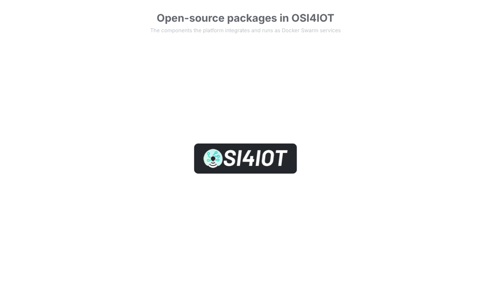

OSI4IOT is an IOT platform based on the integration and extension with custom code of several open source packages. This repository contains the implementation of the OSI4IOT platform.

## Description

The OSI4IOT platform is a web-based IOT platform for monitoring in real time industrial assets and structures. Besides, the platform allows the implementation of Digital Twins Models (DTM) of those assets. A 3D representation of these DTM can be visualized in the web viewer of the platform. The different objects of the DTM are animated in function of the values received from the sensors. Results provided by Finite Elements Method (FEM) models can also be integrated in the DTM.   

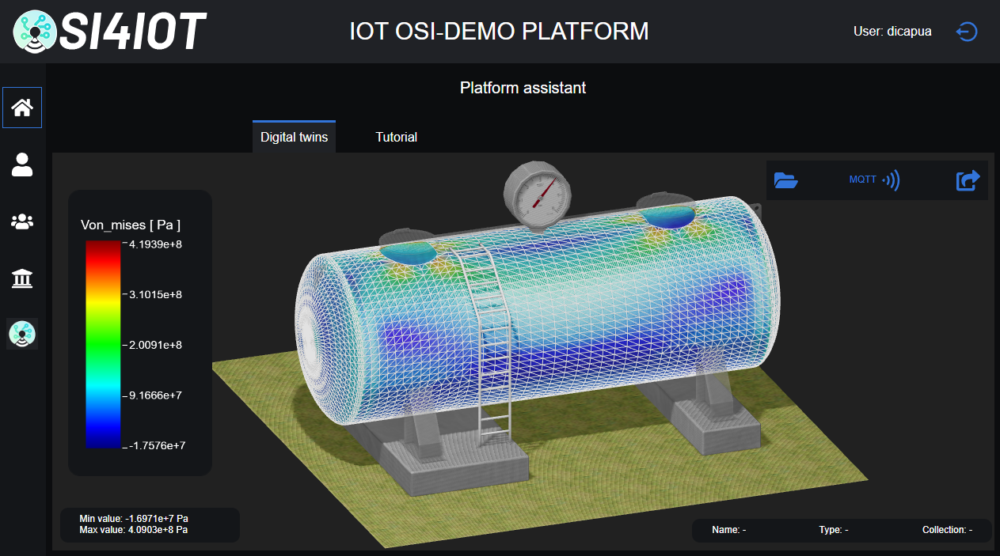

## Table of contents
- [Getting Started](#getting-started)
- [Installation](#installation)
- [Creating a platform](#creating-a-platform)
- [Architecture](#architecture)
- [Operating the platform](#operating-the-platform)
- [Backups and recovery](#backups-and-recovery)
- [CLI reference](#cli-reference)
- [Glossary](#glossary)
- [Usage](#usage)
- [Acknowledgements](#acknowledgements)
- [License](#license)
- [Examples](#examples)
- [Status](#status)

## Getting Started

### Requirements

In order to have the OSI4IOT platform running correctly, the following requirements must be met:
-	Docker installed on every machine of the platform. Please read: .
    -	The `osi4iot` CLI joins the machines into a Docker Swarm itself; there is nothing to set up by hand.
-	For a cluster deployment, SSH access to every machine from the one running the CLI:
    -	On-premise: a user with `sudo` on each machine. The CLI asks for its SSH password once to install the platform's key; it is never stored.
    -	AWS: EC2 instances launched with the platform's key pair.
-	A Telegram bot for notifications. Please read: .
    -	The Telegram bot token.
    -	The chat ID of the Telegram group for the main organization's default group.
    -	The Telegram invitation link for that group.
-	A domain name to access the platform through a web page.
-	An email address to send notifications from the platform, and its password.
-	Optional: an AWS S3 bucket, if the platform's data should be stored outside it (see [Object storage](#object-storage)).

## Installation

The OSI4IOT platform is installed and operated with a command line tool called `osi4iot`. Download the installer for your operating system from GitHub:

    # Linux amd64
    curl -o osi4iot_installer_linux-amd64.sh https://raw.githubusercontent.com/osi4iot/osi4iot/master/utils/osi4iot_go_cli/dist/linux-amd64/osi4iot_installer_linux-amd64.sh

    # Linux arm64
    curl -o osi4iot_installer_linux_arm64.sh https://raw.githubusercontent.com/osi4iot/osi4iot/master/utils/osi4iot_go_cli/dist/linux-arm64/osi4iot_installer_linux_arm64.sh

    # Windows amd64 (PowerShell)
    curl -o osi4iot_installer_win-amd64.ps1 https://raw.githubusercontent.com/osi4iot/osi4iot/master/utils/osi4iot_go_cli/dist/windows-amd64/osi4iot_installer_win-amd64.ps1

and run it. For example, on Linux amd64:

    bash osi4iot_installer_linux-amd64.sh

The installer downloads the `osi4iot` binary to `/usr/local/bin`. Check it with

    osi4iot version

Shell autocompletion (TAB) for every command and service name can be installed with

    osi4iot completion install        # bash, zsh, fish or PowerShell, detected from your shell

## Creating a platform

Every platform lives in its own directory, which holds its state file (`osi4iot_state.json`). Run every `osi4iot` command for that platform from there:

    mkdir <my project>      # Example: mkdir iot_fiber4yard
    cd <my project>
    osi4iot create

`osi4iot create` opens a form with everything the platform needs, and creates and starts the platform when it is confirmed. If enter is pressed on an empty field, the value shown as default is used.

    Platform name: OSI-DEMO
    Domain name: iot_fiber4yards_demo.org
    Platform motivational phrase: Open source integration for internet of things
    Platform admin first name / last name / user name / email / password
    Min/max longitude and latitude of the geographical zone of the platform
    Default time zone: Europe/Madrid
    Main organization name, acronym, address, city, zip code, state/province, country
    Main organization building path / floor path       (GeoJSON files, see docs/geojson.md)
    Telegram bot token, chat id and invitation link for the main organization default group
    Email account for platform notifications / password
    Registration, access and refresh token lifetimes
    Number of nats servers: 1 | 3 | 5
    Use Patroni for high-availability databases? yes | no
    Data retention interval in days for timescaledb
    Select the place of deployment of the platform:
        Local deployment | On-premise cluster deployment | AWS cluster deployment
    Choose the type of S3 bucket to be used: Local Garage | Cloud AWS S3
    S3 storage bucket name
    Choose the type of domain ssl certs to be used:
        No certs | Certs provided by an CA | Let's encrypt certs with DNS-01 challenge and AWS Route 53 provider
    Select deployment mode: development | production
    Resources (CPU and memory) for the messaging, data storage, user interface and pipelines services
    Default number of pipelines instances: 1 | 3 | 5

A guideline for the SSL certificates is found in .

The state file is encrypted. The first command asks for a passphrase, which is remembered on that machine (`osi4iot passphrase reset` forgets it). Keep the passphrase: backups of the state file are encrypted with it as well.

When the platform is up it is accessible through the browser.
  

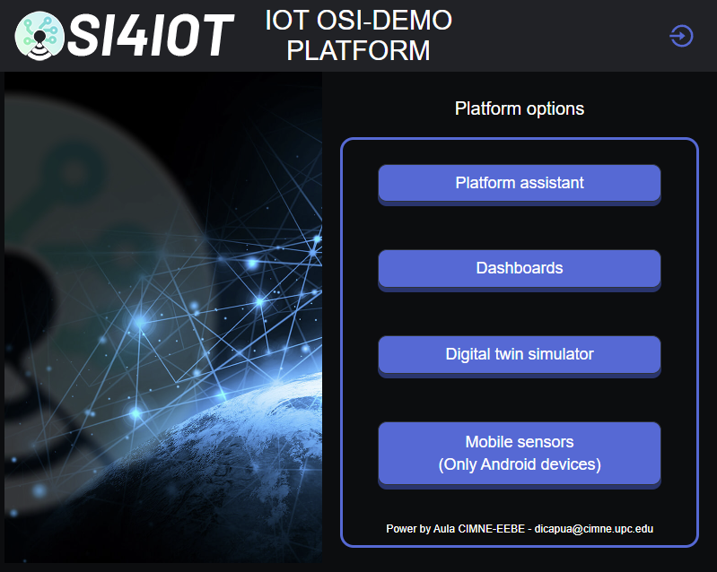

### Deployment types

 Local deployment 

The whole platform runs on a single machine: one NATS server, one node per database and one Garage instance (replication factor 1). The form asks which percentage of the machine's resources the platform may use.

A guideline for the local deployment can be found in .

 On-premise cluster deployment 

The platform runs on several machines of your own. The form asks for the number of nodes and, for each one, its label, IP, SSH user and role:

-	`Manager`: a Docker Swarm manager. The entry point of the platform (Traefik) runs on the managers, and Keepalived keeps a floating IP on one of them. Use 1, 3 or 5 managers.
-	`Platform worker`: runs the platform services. A cluster always needs at least one.

 AWS cluster deployment 

The same as the on-premise cluster, on EC2 instances. The volumes can optionally be AWS EBS volumes instead of local disks.

## Architecture

The platform runs as Docker Swarm services:

| Service | Role |
|---|---|
| `traefik` | Reverse proxy and TLS termination for every web service |
| `frontend` | Web application (platform assistant, 3D viewer, digital twin simulator) |
| `admin_api` | Platform API |
| `nats1..N` | Messaging: NATS with JetStream, MQTT (port 1883) and WebSockets |
| `auth_callout` | Authentication of NATS and MQTT clients |
| `pipelines` | Processing of device data and digital twins |
| `patroni_admin1..N` | PostgreSQL cluster with the platform's data (Patroni, embedded Raft) |
| `patroni_metrics1..N` | TimescaleDB cluster with the sensors' time series |
| `haproxy_patroni` | Entry point to the primary of each database cluster |
| `garage_<ID>` | Garage S3 object store (only with "Local Garage") |
| `garage_webui` | Garage web interface, at `https://<domain>/garage_webui` |
| `grafana`, `grafana_renderer` | Dashboards |
| `pgadmin4` | Database administration |
| `system_manager` | Scheduled and on-demand backups, certificate renewal |
| `keepalived` | Floating IP across the managers (on-premise clusters) |
| `vector` | Logs and host, container and volume metrics of every node |

Without Patroni (`Use Patroni ... = no`) the databases run as single `postgres` and `timescaledb` services instead.

### High availability

NATS, the two Patroni clusters and Garage keep their data on local volumes, so each of their instances is pinned to one worker:

-	NATS and Patroni: every worker carries a placement number per service (`nats_N`, `admin-id=N`, `metrics-id=N`), and instance N runs where number N is. With 3 instances each, the platform keeps working when one worker fails. Numbers are stable: removing or adding a worker only moves what was on it.
-	JetStream streams are kept with 1 copy on a single NATS server and 3 copies on a cluster of 3 or more.
-	`osi4iot node ls` shows every node's labels below the table.

### Object storage

Backups (WAL-G for both databases, NATS streams, the state file) and the platform's files go to one S3 bucket:

-	**Local Garage**: a Garage cluster inside the platform. Replication factor 1 in a local deployment, 3 in a cluster. Its instances are spread over the workers: 1 worker holds 3, 2 workers 2 and 1, 3 or more one each. It needs no external service, but the bucket goes away with the platform's volumes.
-	**Cloud AWS S3**: an external bucket. It outlives the platform, so a deleted platform can be brought back from it (`osi4iot init --from-bucket`).

## Operating the platform

### Lifecycle

    osi4iot status       # state (running, running with problems, stopped, deleted...), services, Garage and nodes
    osi4iot stop         # stop the services; data is kept
    osi4iot run          # start them again
    osi4iot init         # deploy the platform defined in the state file
    osi4iot delete       # remove the platform from the swarm (the S3 bucket is not touched)

Commands that need the platform running say so when it is not, instead of failing.

`osi4iot delete` with an external bucket backs everything up one last time first (`--no-final-backups` skips it). `--remove-bucket` also empties and deletes the bucket, which cannot be undone.

### Checking the stateful services

    osi4iot service state                     # nats, patroni_admin, patroni_metrics and garage
    osi4iot service state garage --probe

For each instance it shows the Swarm task and the service's own view: NATS routes, JetStream leader and streams in sync; Patroni leader, replicas streaming and their lag; Garage write quorum, nodes connected, free disk and resync errors. Each service is reported as **healthy**, **degraded** (it works with less redundancy than it should) or **down**. `--probe` also writes and reads test data in places reserved for it (the NATS subjects `osi4iot.probe.>` and stream `OSI4IOT_PROBE`, the schema `osi4iot_probe` in each database, the prefix `osi4iot_probe/` in the bucket). The exit status is 0 when everything is healthy, 2 when something is degraded and 1 when something is down, so it can be used from scripts.

`osi4iot streams ls` lists the JetStream streams with their replicas, leader and sync status.

### Services

    osi4iot service ls
    osi4iot service inspect admin_api
    osi4iot service scale nats=3                  # 1, 3, 5... (odd); each instance needs its own worker
    osi4iot service scale patroni_admin=3         # likewise for patroni_metrics
    osi4iot service scale garage=4                # 3 or more, at most one per worker (cluster only)
    osi4iot service rebalance garage
    osi4iot service resources admin_api=0.50CPU-1000Mb
    osi4iot service image admin_api=ghcr.io/osi4iot/admin_api_nats:1.3.0

Scaling NATS between 1 and 3 or more servers carries the streams over through a backup in the bucket. Every Garage change (adding, moving or retiring an instance) is one layout change at a time, and an old instance is only removed once its data is safe elsewhere; this takes at least about 10 minutes, Garage's own safety delay. An interrupted change is resumed by `osi4iot service rebalance garage`.

### Nodes

    osi4iot node ls
    osi4iot node inspect worker_1
    osi4iot node ps worker_1
    osi4iot node add --ip 192.168.1.14 --role "Platform worker" --user osi4iot
    osi4iot node drain worker_1
    osi4iot node activate worker_1
    osi4iot node remove worker_1
    osi4iot node update worker_1 --label-add rack=B12

-	`node add` joins the machine to the swarm and gives it its placement labels. Garage is rebalanced onto a new worker straight away (`--no-rebalance` to do it later). Adding a node does not change any replica count.
-	`node drain` stops the node taking work, for maintenance. The NATS, Patroni and Garage instances on it are pinned there and wait. It is refused when one of those services would lose its quorum, counting nodes already drained or down. `node activate` brings the instances back with their data.
-	`node remove` first moves Garage's instances off the node, then drains it, takes it out of the swarm and removes its volumes. Its NATS and Patroni instances go to a spare worker and rebuild their data there from the other instances. It is refused, before anything is touched, when fewer workers would be left than a service has replicas, when a service would lose its quorum, or when the node holds a service's only copy. In that last case, scale the service up first, or back it up, remove the node with `--rebuild-from-backup` and restore it.

## Backups and recovery

`system_manager` backs up both database clusters (WAL-G, continuous archiving), the NATS streams and the state file to the bucket. A copy of the state file is stored every time it changes.

    osi4iot backup trigger  patroni_admin | patroni_metrics | nats_streams | state
    osi4iot backup list     patroni_admin | patroni_metrics | nats_streams | state
    osi4iot backup restore  patroni_admin | patroni_metrics | nats_streams | state

-	`backup restore patroni_admin --target-time '2026-09-08 14:30:00+00'` recovers a database cluster to a point in time. A restore replaces the whole cluster.
-	`backup restore nats_streams` restores the newest run; streams come back with 1 copy on a single server and 3 on a cluster, whatever they had when backed up.
-	For rows or tables deleted by accident, `backup extract` recovers just them from a point in time into a file, without touching the live cluster, and `backup apply` loads that file in one transaction. See `osi4iot backup extract --help` for examples.

### Moving or rebuilding a platform

    osi4iot backup snapshot                           # the whole platform into osi4iot_snapshot.zip
    osi4iot init --snapshot-file osi4iot_snapshot.zip # bring it up on other machines

The snapshot holds the encrypted state file, the newest backup of each database, the NATS streams and the platform's files. Its `state/nodes.json` is in plain text: edit it to describe the new machines. It is also a good off-site backup on its own.

With an external bucket, a deleted platform can be rebuilt from the bucket alone:

    osi4iot init --from-bucket <bucket> --bucket-region <region>

### Recovering the state file

When the platform cannot hand back its state file (stopped, or the file is lost):

    osi4iot state recover --from-bucket <bucket>      # from an external bucket
    osi4iot state recover --from-garage               # from the Garage volumes of a stopped platform
    osi4iot state recover --file <downloaded backup>  # from a backup you downloaded yourself

`osi4iot state export` writes the state file decrypted, as plain JSON.

### Certificates

    osi4iot certs check       # expiration dates
    osi4iot certs update      # renew the Let's Encrypt certificates
    osi4iot certs download    # bring system_manager's renewed certificates into the state file

## CLI reference

Every command has its own help: `osi4iot <command> --help`.

| Command | Subcommands |
|---|---|
| `create` | Create a new platform and start it |
| `init` | Deploy the platform in the state file (`--snapshot-file`, `--from-bucket`, `--nodes`, `--reset-passwords`) |
| `run` / `stop` / `delete` | Start, stop, remove the platform |
| `status` | Platform state, services, Garage and nodes |
| `service` | `ls`, `inspect`, `scale`, `rebalance`, `resources`, `image`, `state` |
| `node` | `ls`, `inspect`, `ps`, `add`, `drain`, `activate`, `remove`, `update` |
| `backup` | `trigger`, `list`, `restore`, `extract`, `apply`, `snapshot` |
| `state` | `export`, `recover` |
| `streams` | `ls` |
| `certs` | `check`, `update`, `download` |
| `custom_service` | `list`, `add`, `update`, `remove` |
| `passphrase` | `reset` |
| `completion` | `install`, `bash`, `zsh`, `fish`, `powershell` |
| `version` | |

## Glossary

 OSI4IOT ecosystem 

The `OSI4IOT` platform is not limited to monitor different sensors and to provide an equivalent 3D digital twin of an asset. When considering the IOT technologies, large and distinct information can be gathered, post-processed and generated by different stakeholders. To control that the information is only accessible to the right person, the platform considers different levels of abstraction:

-	Organizations
-	Groups
-	Devices
-	Assets

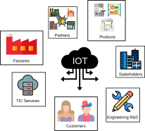

 Organizations 

`Organizations` are the most external level of hierarchy found in the platform. An `Organization` represents an `stakeholder` in the `OSI4IOT ecosystem`. A `stakeholder` can be either a `cluster of organizations` or a `unique organization`. The contents of a `stakeholder` is not limitted to the `partial` or `complete` content of the `same` organization, but `partial` or `complete` contents of `different` organizations.
  
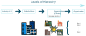

Only the `platform admin` has access to all the information stored in each `stakeholder`, however, `different organizations` can share with each other partial information through a `organization-to-organization message protocol`.

### The simple organization
___
The simplest stakeholder would be to harbor the `partial` or `complete` contents of a `unique organization`. In this case the stakeholder could be just a company and the immediate inner level of hierarchy, the `group` level, could be departments of the company.

### Partners and more complex structures
___
When the structure of the stakeholder is not straightforward, for example in the case of a `cluster of organizations` harboring `partial` or `complete` content of the `different` organizations.

This type of structure could be useful in the case of a `single organization` that not only subdivides its structure into departments at the `group` level, but also when it has to manage data coming from different sources such as partner organizations, customers and suppliers integrated into the platform.

The most complex infrastructure that can be deployed and integrated in the `OSI4IOT` platform would be the case of different organizations working together (`cluster`) and wanting to digitalize and interconnect their processes and information generated. In this case the stakeholder level would be the `cluster` and the `group` level would be comprised from `organization's departments` to `partners`.

Inside the platform, the `organizations` or `stakeholders` are geolocated and displayed in the map with all their content information (`groups`, `assets` and `sensors`).

In the map, first you can see a general view with all the `organizations` included in the platform.

  
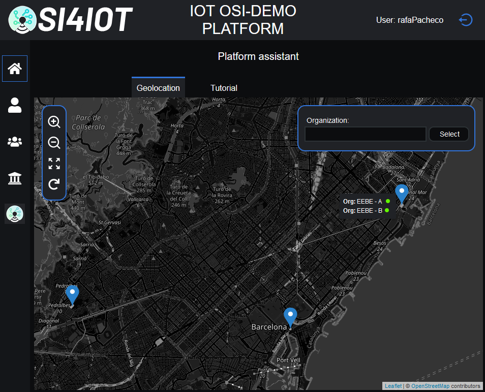

If one of the `leaflets` are selected, the view will focus on the building of the selected `organization`.

  
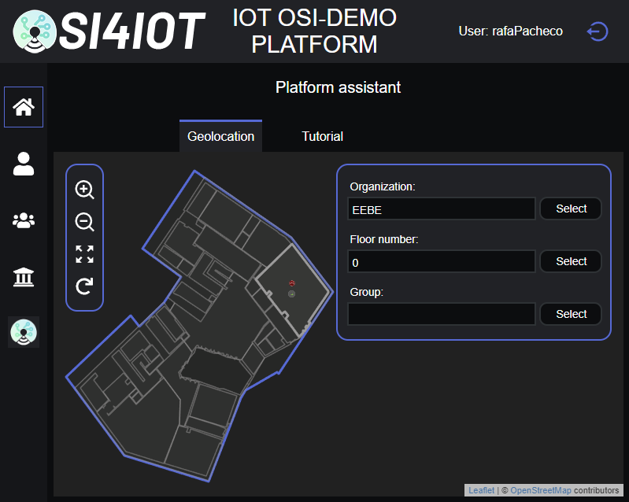

 Groups 

The next level of hierarchy is the `group`. This level offers the possibility to divide the data stored in the platform in different compartments. This way only members that are at the `organizations` level can access to all the groups, but a unique member of a specific group cannot access the information of another group.

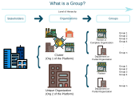

Although a member of `Group 1` would not have access to `Group 2`. There is the possibility to share information between groups using a `group-to-group message protocol` similar to the protocol between `organizations`.

Inside the platform, the `groups` are geolocated and displayed in the map inside the domain of their `organization`, the information that can be displayed are the `devices` and `nodes` of the `group`.

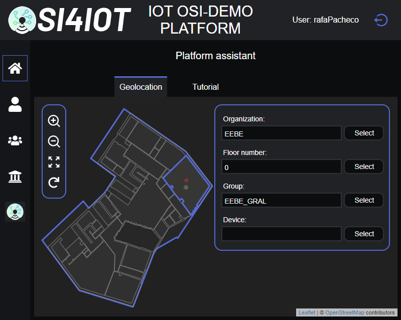

 Assets 

A `device` can have one or more industrial machines connected to it in order to control the production process. This machines or parts of a machine are represented by an abstraction called `asset`.
  
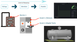

Inside an `asset` can have the following components:

-	Sensors

    An `asset` can have multiple sensors to measure the relevant parameters that allow defining its status. Temperature, pressure, viscosity or accelerometer sensors are typically used in the manufacturing industry.

-	Digital twins

    An `asset` can have one or several digital twins. A digital twin is a virtual model designed for accurately reflect the physical state of the asset. The function of the digital twin models are the following.

    -	Asset state monitoring
    -	Predictive maintenance
    -	Alert system in case of incidents

    To implement a digital twin, machine learning models trained by mean of the data collected by the sensors, can be used. Other methodologies, such as the application of model order reduction to physically-based model are also available.

-	Asset state

    The state of the `asset` at a given instant is defined by a set of parameters. These parameters are obtained from the data collected by the sensors and from some evolution model. It is important to store in a database the historical evolution of the asset state so that they can be used in the development of digital twins.

-	Asset topics

    The communication protocols typically used in IOT technologies (MQTT, NATS, Apache Kafka) use the term topic (or subject) to refer to the text string used to filter the messages that a publisher sends to the receivers.
    It is necessary to store in database a list of the different topics used to send data related with the assets.

 Role System  

Once you understand the key points of the platform components, the hierarchy levels and what is the purpose of each level. The other missing part is how to manage the platform components. This is the purpose of the role managing system, which associates a role to certain levels.

If logged into the platform, the first thing that you will see is the role menu bar in the left. From bottom to top of the role menu bar we have:

- Super Admin: role associated generally to the people who are in charge of the `platform` and generally install it.
- Organizations Admin: role associated to the management of the `organizations`, creation of `groups`, etc.
- Groups Admin: role associated to the management of `groups`, creation of `devices` and `assets`.
- User: role associated with the management of the personal information of the corresponding user.

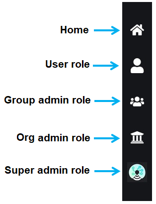

The hierarchy of roles is established as:

`Super Admin` > `Organizations Admin` > `Groups Admin` > `User`

The `home` button is just the viewer and it is available to all the roles. The descendent order implicates that the role below is of higher rank, for example a `Super Admin` can manage the same information as the `Organizations Admin`, but not otherwise.

The following picture illustrates the information that can be accessed by the different roles.
   
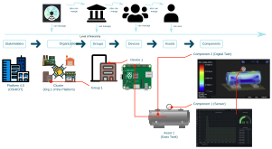

## Usage

This section aims to explain what can be done and how the different services provided by the `OSI4IOT` platform can be accessed.

 Home screen  

The home screen hosted in the the domain provided in the CLI offers 4 possibilities:

- Platform assistant:

    The core of the platform where the different users can access to all information stored in the platform. It gives access to the managing role menus.

- Dashboards

    Use this option to open Grafana application in another browser tab.

- Digital twin simulator

    This option is a simulator for the Digital Twin Models. This simulator allows to modify the parameters of the `DTM` in real time. With this, you can display the model in a device and control the simulation parameters from another one.

- Mobile sensors (Only Android devices)

    This option is used to demonstrate that the platform also integrates mobile technology. For example, it is possible to capture the accelerometers of an Android phone or even use machine learning models to label information from a picture taken by the phone.

 Login  

The first thing that is needed is the access through the login screen. If you are the `Super Admin`, then you will login with the credentials introduced in the `CLI`, however if you are not the one who initialized the platform or have a lower rank assigned, then you will need to be invited by the `Super Admin`. This is easily done by means of adding a new user (you need an e-mail) in the `Global users` tab of the actions available to the `Super Admin`.

Click on the top right icon to login.

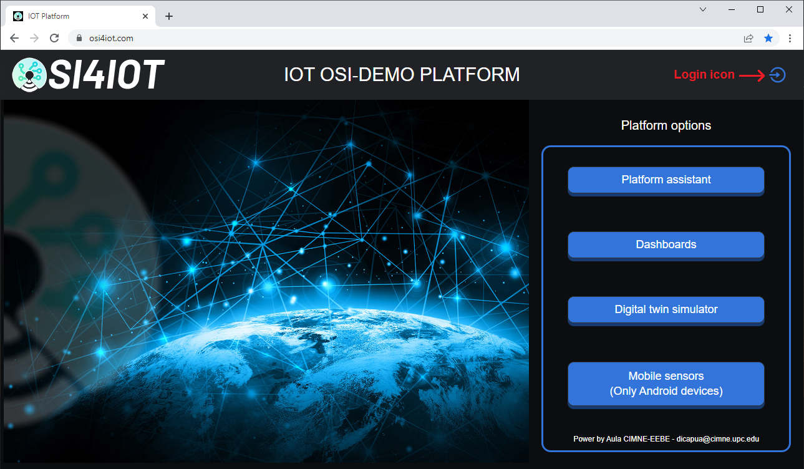

Then fill the form and submit.

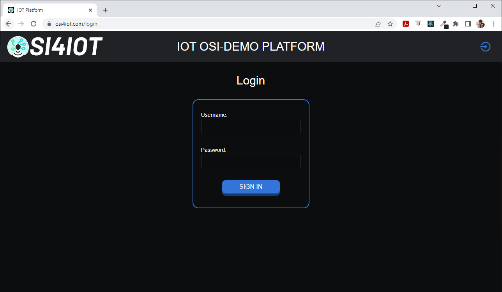

Then you will be redirected to the Platform assistant app, where you will be able to see the different organizations in the map.

 Dashboards  

One of the type of information that can be visualized are dashboards, useful to desplay simple sensor data and with the option to send alerts through the notification system when a certain threshold is trespassed.

It can be accessed from the viewer by clicking the `dashboard` icon.

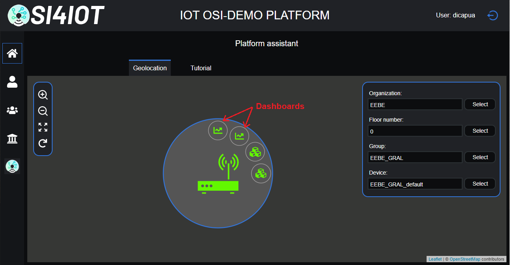

Then the dashboard is displayed. In this example the measurements of a temperature sensor.

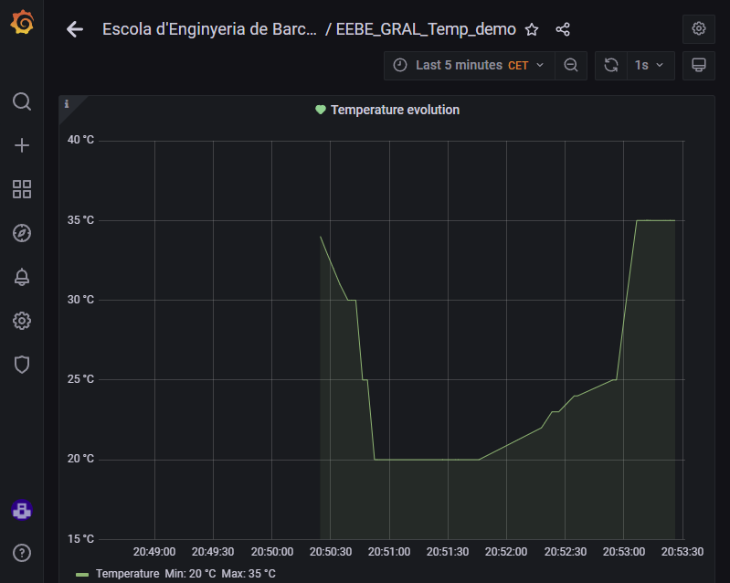

The same result can be achieved from the `Dashboards` option in the home screen. A list of the different dashboards is shown, the access to the list depends on the account rank of the user, then select the appropiate dashboard.

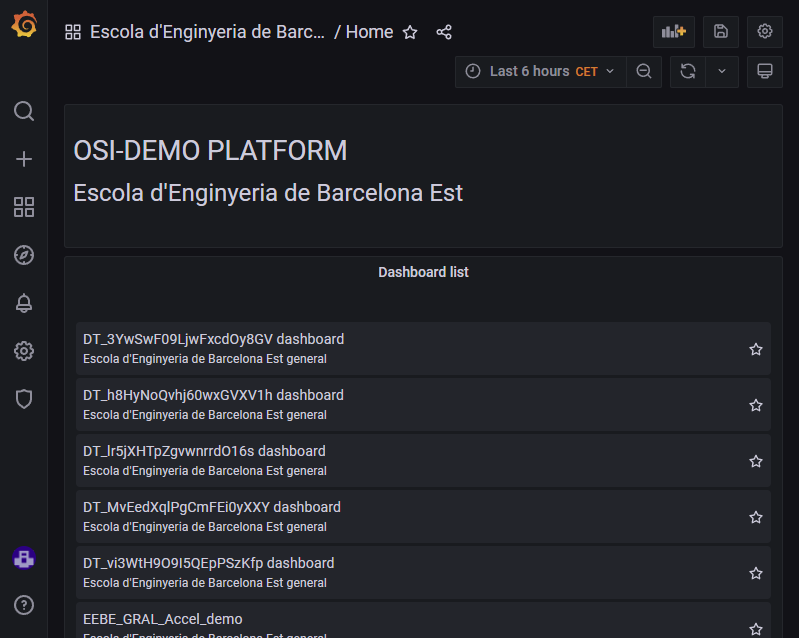

 Digital Twin Model  

The other type of information that can be displayed are the `Digital Twin Models` (`DTM`). They can be accessed when selecting a device, and by clicking the `DTM` icon (three boxes), the viewer will load a 3D digital twin.

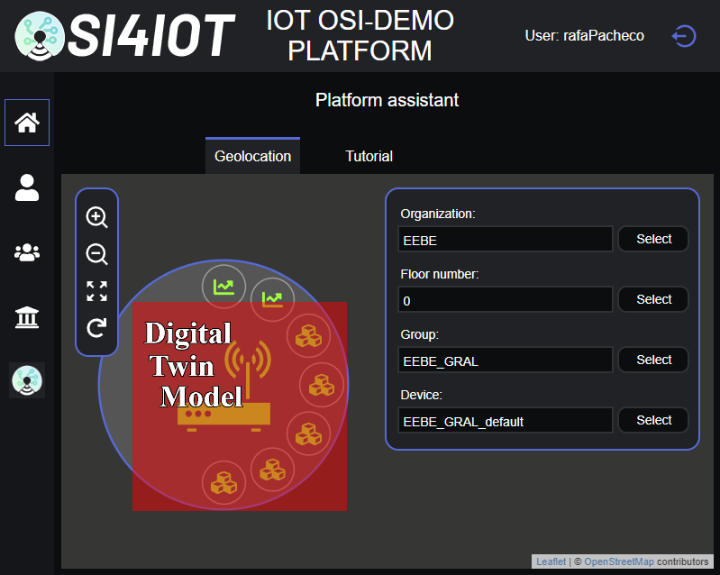

Here you can control and monitor the sensor information, in this example, the level of water in a tank on top of a building structure. The rendering offers the possibility to show the current results in the format of a `Finite Element Method` mesh or in short `FEM` mesh. For example the distribution of stresses in the floor and at the current time to plot the deformation, in real scale or custom. The platform offers the possibility to lock the measurements and use the simulator to observe hypothetical scenarios. Sensors embedded in the digital twin can also be accessed by clicking the sensor in the 3D model.

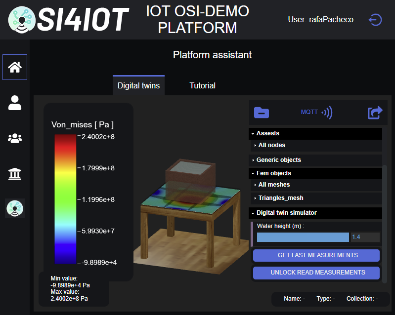

It can also be the case that you may want to monitor an asset with the 3D view while simulating the model with an external device. This can be done by using the `Digital Twin Simulator` option in the home screen. You will see in real time the modifications introduced in the simulation.

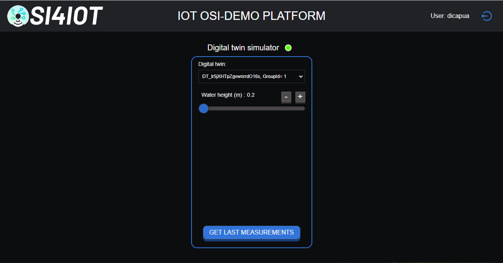

 Node-RED  

Any 'DTM' requires a logic to analyze in real time the information coming from the sensors and decide whether to trigger an alert when something goes wrong. This task can be done with the help of Node-RED, an open source package that allows graphically to interconnect the data and manipulate it. You can either create custom boxes or use existing template boxes to design the flow diagram of the logic of your `devices`.

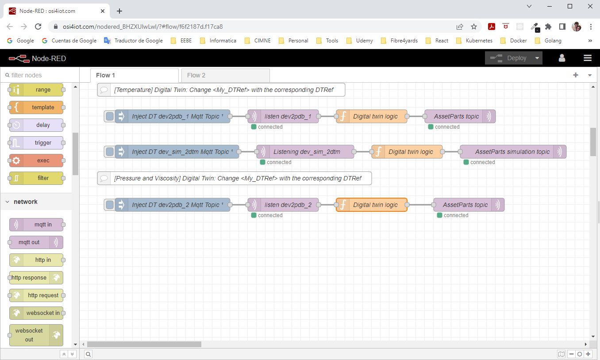

The Node-RED instances can be accessed by clicking into the Node-RED icon in the map.

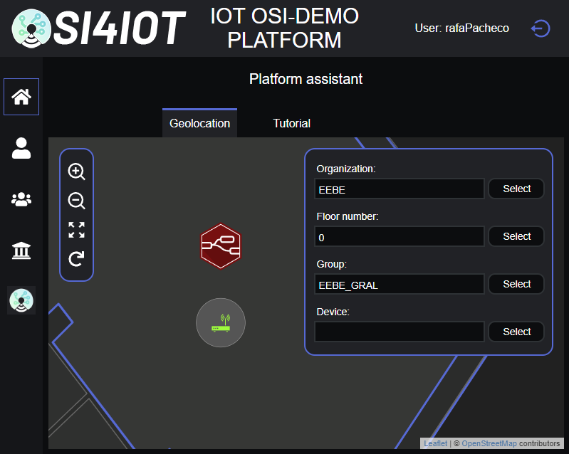

 How to send messages through the MQTT protocol 

Devices send their data to the platform with MQTT, through the MQTT interface of the platform's NATS servers. This message protocol uses a `publish`/`subscribe` model associated to a `topic`. `Topics` are the channels of information where a `device` can connect to `publish` data or `subscribe` to fetch information.

The platform implements a specific format to communicate through the MQTT protocol. Note that `devices` are associated to `groups`, and they send information through a `topic`. However, the format also takes into account the type of information that is sent in the `topic`. Therefore the format required to establish communication from a `device` to the platform is:

    <topic type>/Group_<group hash>/Device_<device hash>/Topic_<topic hash>

Topic types:

- dev2pdb : Device to platform database.
- dev2pdb_wt : Device to platform database with timestamp.
- dev2pdb_ma : Device to platform database messages array.
- dev_sim_2dtm: Simulated device to DTM.
- dtm_as2pdb : DTM assets state to platform database.
- dtm_sim_as2dts: DTM simulated assets state to DTS.
- dtm_fmv2pdb: DTM fem modal value to platform database.
- dtm_sim_fmv2dts: DTM simulated fem modal value to DTS.

Besides complying with the format, the security of the platform ensures that only the roles that can manage devices are allowed to send or receive information through a topic. Therefore you need to connect through credentials to the platform prior to use a `topic`.

Not only users can use their credentials to send or receive information. There is the option that the `device` that `publish` and `subscribes` to the `topic` does itself. In that case, there is the option to download the `SSL certificates`, three certficates (`CA`,`Client Certificate`, `Client Key`). This method enables the device to send or fetch information without any account.

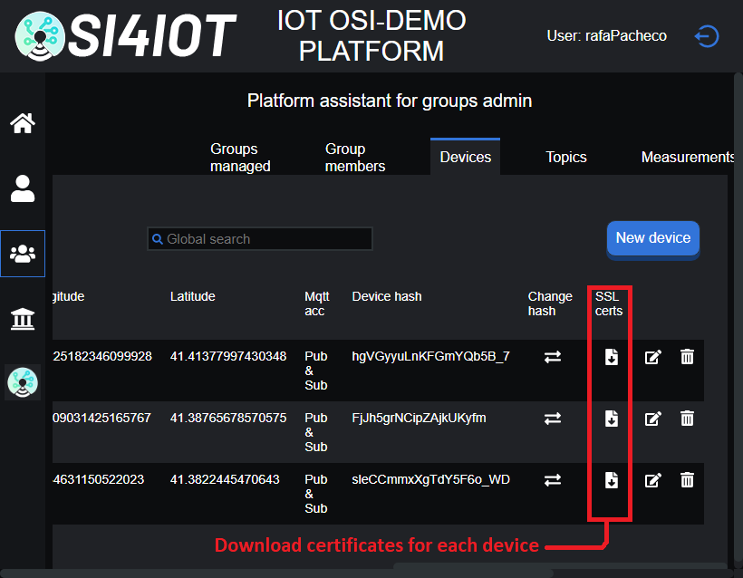

There is a more complete manual on how to communicate and use the MQTT protocol available in .

## Acknowledgements

This OSI4IOT platform has been funded thanks to H2020 project FIBRE4YARDS sponsored by the EUROPEAN COMMISSION under the grant agreement 101006860 ‘‘FIBRE composite manufacturing technologies FOR the automation and modular construction in shipYARDS’’. https://www.fibre4yards.eu/.

## License

The open-source packages utilized within the OSI4IOT platform are being used in compliance with their respective licenses.

The custom code developed in OSI4IOT platform is licensed under the Apache 2.0 License - see the [LICENSE](https://github.com/osi4iot/OSI4IOT/blob/master/LICENSE) file for details.

## Examples

Note: videos may take a few seconds to be loaded.

 Composite slab 

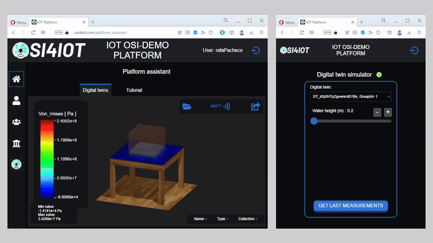

 Gas tank 

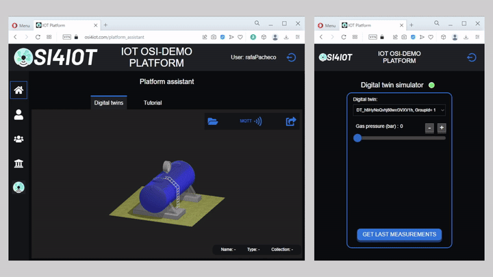

 Aluminium beam 

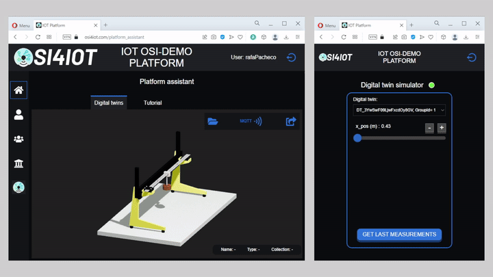

## Status

- [x] Messaging with NATS (JetStream, MQTT and WebSockets).
- [x] Time series database (TimescaleDB).
- [x] High-availability databases (Patroni) with continuous backups (WAL-G).
- [x] S3 object storage (Garage, or AWS S3).
- [x] Dashboards Customization (Grafana).
- [x] Digital Twin Model 3D Viewer (React).
- [x] Machine Learning.
- [x] Improve database data retention policies.
- [x] Health checks of the stateful services (`osi4iot service state`).
- [ ] Org2Org & Group2Group message system.
