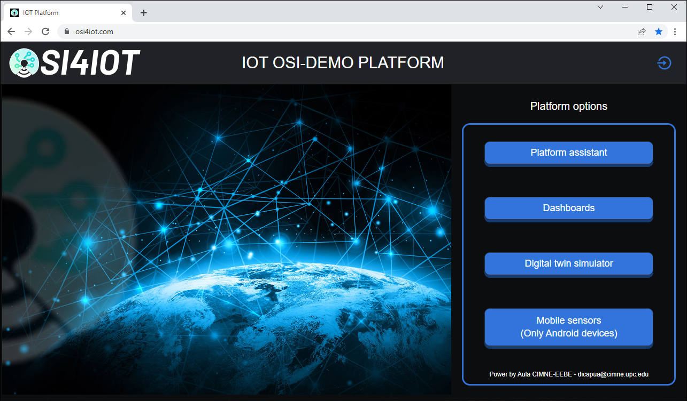
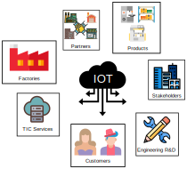
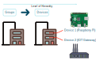
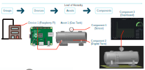
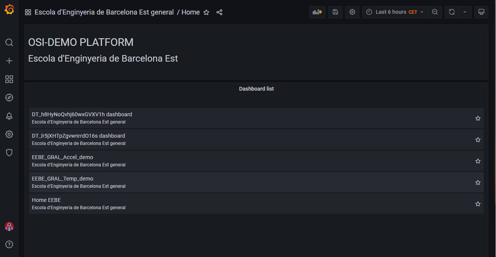
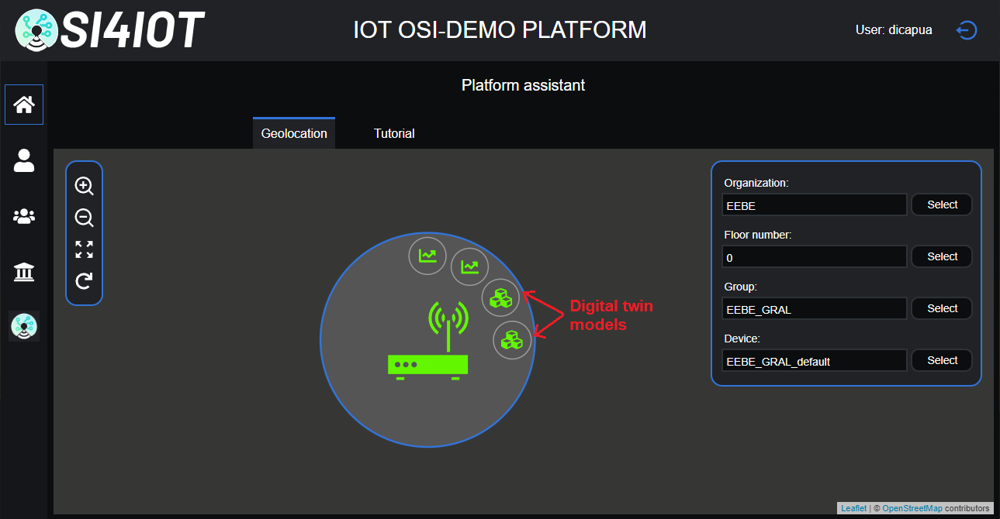
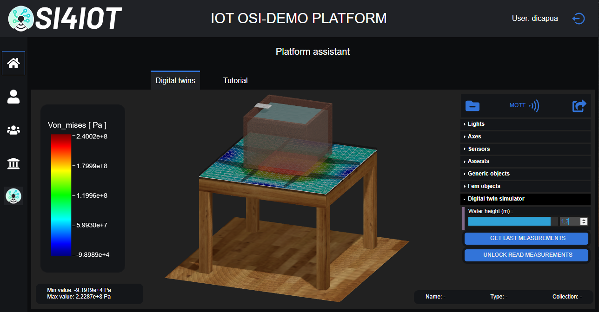

# OSI4IOT - Open Source Integration for Internet Of Things 

OSI4IOT is an IOT platform based in the integration of several open source packages with custom code. This repository contains implementation of the OSI4OT platform.

## Description

This OSI4IOT platform allows the creation of Digital Twins Models (DTM). A 3D respresentation of these DTM can be visualized in the web user interface of the platform. The different objects of the DTM are animated in function of the values recieved from sensors. Results provided by the Finite Elements Method can be integrated in the DTM.   

## Table of contents
- [About](#about)
- [Getting Started](#getting_started)
- [Installation](#installation)
- [Glossary](#glossary)
- [Usage](#usage)
- [Contributing](#contributing)
- [License](#license)
- [Status](#status)

<!-- - [About](#about)
- [Quick Start](#quick_start)
- [Getting Started](#getting_started)
- [Instalation](#instalation)
- [Other instructions, Specifications, Attributes or Project Info](#other_instructions,_Specifications,_Attributes,_or_Project_Info)
- [Usage](#usage)
- [Contributing](#contributing)
- [License](#license)
- [Test](#test)
- [Example](#example) -->
<!-- ## About
The OSI4IOT platform has been developed to give answer to all the elements required in the Industry 4.0 strategy. The OSI4IOT name stand for "Open Source Integration For Internet of Thing".  -->

<!-- ## Quickstart (For The Impatient) -->

## Getting Started

### Requirements

In order to have the OSI4IOT platform running correctly, the following requirements must be met:
-	Installation of Docker in the Operative System (OS). Please read: .
-	Creation of a Telegram Bot for notification. Please read: .
    -	Obtain the Telegram bot token.
    -	Obtain the group ID of the Telegram group for the main organization's default group.
    -	Obtain the Telegram invitation link for the main organization's default group.
-	Have a domain name to access the platform through a webpage.
-	Have an email address to send notifications from the platform. The password for this email is also required.

## Installation

The OSI4IOT platform must to be installed by mean a Command Line Interface (CLI) tool called `osi4iot`. To install the `osi4iot` in your machine it is neccesary to download from Github the proper installer for your operating system:

    // Installer Linux amd64:
    curl -o osi4iot_installer_linux_x64.sh https://raw.githubusercontent.com/osi4iot/osi4iot/master/utils/osi4iot_cli/dist/linux_x64/osi4iot_installer_linux_x64.sh

    // Installer Linux arm64:
    curl -o osi4iot_installer_linux_arm64.sh https://raw.githubusercontent.com/osi4iot/osi4iot/master/utils/osi4iot_cli/dist/linux_arm64/osi4iot_installer_linux_arm64.sh

    // Installer Windows:
    curl -o osi4iot_installer_win_x64.ps1 https://raw.githubusercontent.com/osi4iot/osi4iot/master/utils/osi4iot_cli/dist/win_x64/osi4iot_installer_winx_x64.ps1

Once the appropriate installer for your operating system has been downloaded, it must be executed. For example, if you are using a Linux ARM 64-bit system use 

    bash osi4iot_installer_linux_arm64.sh

Once the `osi4iot` CLI tool has been successfully installed, then initialize the OS4IOT platform by typing

    mkdir <my project>  // Example: mkdir iot_fiber4yard
    cd <myproject>      // Example: cd iot_fiber4yard
    osi4iot

A message prompt similar to this should appear:

    ************************************************
    **   WELCOME TO OSI4IOT PLATFORM CLI v1.1.0  **
    ************************************************

    ? Select the place of deployment of the platform: (Use arrow keys)
    > Local deployment
    On-premise cluster deployment
    AWS cluster deployment

The OSI4IOT platform allows three types of deployments

 Local deployment 
 

The local deployment option if for install the OSI4IOT plataform in a single machine.
Select the local deployment option. The following options will be available

    ************************************************
    **   WELCOME TO OSI4IOT PLATFORM CLI v1.1.0  **
    ************************************************

    ? Select the place of deployment of the platform: Local deployment

    Init platform
    Run platform
    Clear screen
    List organizations
    Create organization
    Update organization
    Remove organization
    Recover nodered instances
    List nodes
    Add nodes
    Remove node
    Update domain certs
    Platform status
    Stop platform
    Delete platform
    Exit

To initialize the platform for first time, use

    Init platform

Several fields will be then prompt to be input. If enter pressed, the option between parenthesis will be inserted instead.

    ************************************************
    **   WELCOME TO OSI4IOT PLATFORM CLI v1.1.0  **
    ************************************************

    ? Select the place of deployment of the platform: Local deployment

    ? Choose one of the following options:  Init platform
    ? Platform name: OSI-DEMO
    ? Domain name: iot_fiber4yards_demo.org
    ? Platform motivational phrase: Open source integration for internet of things
    ? Platform admin first name: admin_f4y
    ? Platform admin last name: demo
    ? Platform admin user name: admin_f4y_demo
    ? Platform admin email: admin_f4y_demo@gmail.com
    ? Platform admin password: **************
    ? Retype platform admin password: **************
    ? Min longitude of the geographical zone of the platform: -10.56884765625
    ? Max longitude of the geographical zone of the platform: 1.42822265625
    ? Min latitude of the geographical zone of the platform: 35.55010533588552
    ? Max latitude of the geographical zone of the platform: 44.134913443750726
    ? Default time zone: Europe/Madrid
    ? Main organization name: My main org
    ? Main organization acronym: MYORG
    ? Main organization address: fake street, fake number
    ? Main organization city: fake city
    ? Main organization zip code: 00000
    ? Main organization state/province: fake province
    ? Main organization country: Spain
    ? Telegram boottoken for main organization default group: 5342540378:AAHrJ4ABFiX54m6uf9RvxHxLRKeo0dGiHA0
    ? Telegram chat id for main organization default group: -694425020
    ? Telegram invitation link for main organization default group: https://t.me/+MgGprvw5SAozODq0
    ? Number of node-red instances in main org: 3
    ? Email account for platform notifications: admin_f4y_demo@gmail.com
    ? Email account password: **************
    ? S3 storage bucket name: osi-demo

A guideline for the local deployment can be found in .

Next, select the type of certificate for your domain SSL certification.

    ? Choose the type of domain ssl certs to be used: (Use arrow keys)
    > No certs
    Certs provided by an CA
    Let's encrypt certs and AWS Route 53
    AWS Certificate Manager

A guideline for the SSL certificates is found in .

If the certificates are correctly introduced, the platform should be initialized correctly. A similar image to this one should be obtained.

 On-premise cluster deployment 
 

The on-premise cluster deployment option if for install the OSI4IOT plataform in a cluster of machines on-premise.

 AWS cluster deployment 
 

The AWS cluster deployment option if for install the OSI4IOT plataform in a cluster of machines on AWS.

  

Now the platform should be accessible through the browser.

<!-- ## Other Instructions, Specifications, Attributes, or Project Info -->
<!-- ### Docker  -->

## Glossary

 Platform components  
  

For a more extensive documentation visit .

The `OSI4IOT` ecosystem is not limited to monitor different sensors and to provide an equivalent 3D digital twin of an asset. When considering the Industry 4.0 technology, large and distinct information can be gathered, post-processed and generated. The platform is built around the concept of `Building Information Modeling` (`BIM`), a technology that aims to contain and interlink all information available in a unique integrated system.

In order to monitor and access the available `BIM` information. The platform divides the information in several layers or levels of hierarchy. 

<!--  -->

### Stakeholders and organizations

`Stakeholders` and `organizations` are the most external level of hierarchy found in the platform. The stakeholder represents an entity that can be either a `cluster of organizations` or a `unique organization`. The contents of a `stakeholder` is not limitted to the `partial` or `complete` content of the `same` organization, but `partial` or `complete` contents of `different` organizations. 

Only the `platform admin` has access to all the information stored in each `stakeholder`, however, `different organizations` can share with each other partial information through a `organization-to-organization message protocol`.

#### The simple organization
___
The simplest stakeholder would be to harbor the `partial` or `complete` contents of a `unique organization`. In this case the stakeholder could be just a company and the immediate inner level of hierarchy, the `group` level, could be departments of the company.

#### Partners and more complex structures
___
When the structure of the stakeholder is not straightforward, for example in the case of a `cluster of organizations` harboring `partial` or `complete` content of the `different` organizations.

This type of structure could be useful in the case of a `unique organization` that not only subdivides its structure in departments at the `group` level, but also has `BIM` data from the partners, client and provider organizations, integrated in the platform.

The most complex infrastructure that can be deployed and integrated in the `OSI4IOT` platform would be the case of different organizations working together (`cluster`) and wanting to digitalize and interconnect their processes and information generated. In this case the stakeholder level would be the `cluster` and the `group` level would be comprised from `organization's departments` to `partners`.

Inside the platform, the `organizations` or `stakeholders` are geolocated and displayed in the map with all their content information (`groups`, `devices` and `nodes`).

### Groups

The next level of hierarchy is the `group`. This level offers the possibility to divide the `bim` information stored in the platform in different compartments. This way only members that are at the `stakeholder` or `organizations` level can access to all the groups, but a unique member of a specific group cannot access the information of another group.

Although a member of `Group 1` would not have access to `Group 2`. There is the possibility to share information between groups using a `group-to-group message protocol` similar to the protocol between `organizations`.

Inside the platform, the `groups` are geolocated and displayed in the map inside the domain of their `organization`, the information that can be displayed are the `devices` and `nodes` of the `group`.

### Devices

The type of information stored inside a `group` are `devices`. These are the next hierarchy level. Each `group` within an `organization` can have several `devices` connected to internet to send data. These `devices` can be PLCs, microcontrollers, microcomputers (like Raspberry Pi), IOT gateways (like SIMATIC IOT2050 of Siemens), etc. 

In the platform, the `devices` are geolocated inside their corresponding `group` and displayed with a bubble. Each `device` contains `assets`.

### Assets

A `device` can have one or more industrial machines connected to it in order to control the production process. This machines or parts of a machine are represented by `assets`.

In the platform there are different types of assets. 

-	Sensors

    An `asset` can have multiple sensors to measure the relevant parameters that allow defining its status. Temperature, pressure, viscosity or accelerometer sensors are typically used in the manufacturing industry.

-	Digital twins

    An `asset` can have one or several digital twins. A digital twin is a virtual model designed for accurately reflect the physical state of the asset. The function of the digital twin models are the following. 

    -	Asset state monitoring
    -	Predictive maintenance
    -	Alert system in case of incidents

    To implement a digital twin, machine learning models trained by mean of the data collected by the sensors, can be used. Other methodologies, such as the application of model order reduction to physically-based model are also available.

-	Asset state

    The state of the `asset` at a given instant is defined by a set of parameters. These parameters are obtained from the data collected by the sensors and from some evolution model. It is important to store in a database the historical evolution of the asset state so that they can be used in the development of digital twins.

-	Asset topics

    The communication protocols typically used in IOT technologies (MQTT, Apache Kafka and Apache Pulsar) use the term topic to refer to the text string used to filter the messages that a publisher sends to the receivers.
    It is necessary to store in database a list of the different topics used to send data related with the assets.

-	Product list
-	Product tracking
-	Supplies management

 The Role System  
 

<!-- For a more extensive documentation visit . -->

Once you understand the key points of the platform components, the hierarchy levels and what is the purpose of each level. The other missing part is how to manage the platform components. This is the purpose of the role managing system, which associates a role to certain levels.

If logged into the platform, the first thing that you will see is the role menu bar in the left. From bottom to top of the role menu bar we have:

- Super Admin: role associated generally to the people who are in charge of the `platform` and generally install it.
- Organizations Admin: role associated to the management of the `organizations`, creation of `groups`, etc.
- Groups Admin: role associated to the management of `groups`, creation of `devices` and `assets`.
- User: role associated to the display of `devices` and `assets`.

The hierarchy of roles is established as: 

`Super Admin` > `Organizations Admin` > `Groups Admin` > `User`

The `home` button is just the viewer and it is available to all the roles. The descendent order implicates that the role below is of higher rank, for example a `Super Admin` can manage the same information as the `Organizations Admin`, but not otherwise. 

The following picture illustrates the information that can be accessed by the different roles. Note that although the `User` can view and access the devices of a `group`, it is not able to create, edit or erase them. This options are available at the `Group Admin` level.

## Usage

This section aims to explain what can be done and how the different services provided by the `OSI4IOT` platform can be accessed.

 Home screen  
  

The home screen hosted in the the domain provided in the CLI offers 4 possibilities:

- Platform assistant:

    The core of the platform where the different users can access to the `BIM` information stored in the platform. It gives access to the managing role menus.

- Dashboards

    Use this option to load quickly a particular or various dashboards already created.
- Digital twin simulator

     Use this option to load quickly a particular or various Digital Twin Models already created and have access to the simulation parameters in real time. With this, you can display the model in a device and control the simulation parameters from another one.
- Mobile sensors (Only Android devices)

    This option is used to demonstrate that the platform also integrates mobile technology. For example, it is possible to capture the accelerometers of an android phone or even use machine learning models to label information from a picture taken by the phone.

 Login  
  

The first thing that is needed is the access through the login screen. If you are the `Super Admin`, then you will login with the credentials introduced in the `CLI`, however if you are not the one who initialized the platform or have a lower rank assigned, then you will need to be invited by the `Super Admin`. This is easily done by means of adding a new user (you need an e-mail) in the `Global users` tab of the actions available to the `Super Admin`.

Click on the top right icon to login.

Then fill the form and submit.

Then you will be redirected to the Platform assistant app, where you will be able to see the different organizations in the map.

 Dashboards  
  

One of the type of information that can be visualized are dashboards, useful to desplay simple sensor data and with the option to send alerts through the notification system when a certain threshold is trespassed. 

It can be accessed from the viewer by clicking the `dashboard` icon. 

Then the dashboard is displayed. In this example the measurements of a temperature sensor.

The same result can be achieved from the `Dashboards` option in the home screen. A list of the different dashboards is shown, the access to the list depends on the account rank of the user, then select the appropiate dashboard.

 Digital Twin Model  
  

The other type of information that can be displayed are the `Digital Twin Models` (`DTM`). They can be accessed when selecting a device, and by clicking the `DTM` icon (three boxes), the viewer will load a 3D digital twin.

Here you can control and monitor the sensor information, in this example, the level of water in a tank on top of a building structure. The rendering offers the possibility to show the current results in the format of a `Finite Element Method` mesh or in short `FEM` mesh. For example the distribution of stresses in the floor and at the current time to plot the deformation, in real scale or custom. The platform offers the possibility to lock the measurements and use the simulator to observe hypothetical scenarios. Sensors embedded in the digital twin can also be accessed by clicking the sensor in the 3D model.

It can also be the case that you may want to monitor an asset with the 3D view while simulating the model with an external device. This can be done by using the `Digital Twin Simulator` option in the home screen. You will see in real time the modifications introduced in the simulation.

 Node-RED  
  

Any `dashboard` or `dtm` requires a logic or core to decide how the information from sensors is connected with the database and how the alerts are displayed. This task can be done with the help of Node-RED, an open source package that allows graphically to interconnect the data and manipulate it. You can either create custom boxes or use existing template boxes to design the flow diagram of the logic of your `devices`.

The Node-RED instances can be accessed by clicking into the Node-RED icon in the map.

## Contributing
We welcome contributions to OSI4IOT. Please read [CONTRIBUTING.md](https://github.com/%3Cyour_username%3E/OSI4IOT/blob/master/CONTRIBUTING.md) for more information.

## Acknowledgements

The OSI4IOT platform has been funded by the European Union's Research and Innovation Programme Horizon 2020 under the Grant Agreement No 101006860.

## License

The open-source packages utilized within the OSI4IOT platform are being used in compliance with their respective licenses.

The custom code developed in OSI4IOT platform is licensed under the Apache 2.0 License - see the [LICENSE](https://github.com/osi4iot/OSI4IOT/blob/master/LICENSE) file for details.

<!-- ## Test -->

## Examples

### Pool

### Tank

### Encastred-Supported Beam 

## Status

- [x] Mqqt protocol (Mosquitto).
- [x] Time series database (Timescale).
- [x] Dashboards Customization (Grafana).
- [x] Digital Twin Model Core (Node-Red).
- [x] Digital Twin Model 3D Viewer (React).
- [x] S3 bucket storage (Minio - AWS S3).
- [ ] Machine Learning.
- [ ] Improve database data retention policies.
- [ ] Org2Org & Group2Group message system.   
