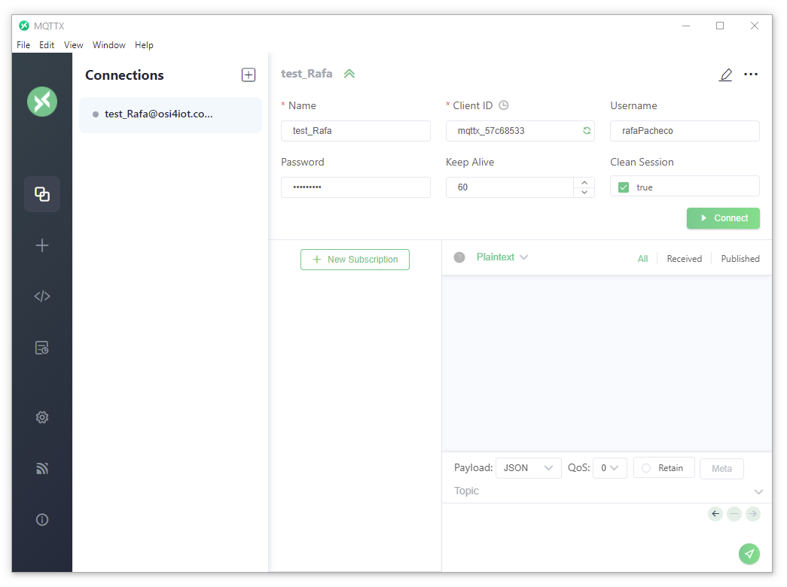
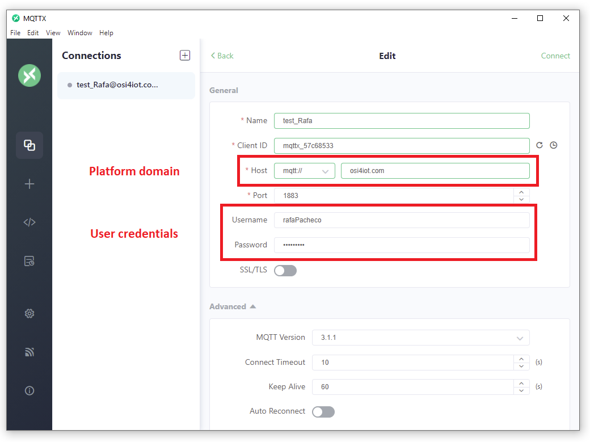
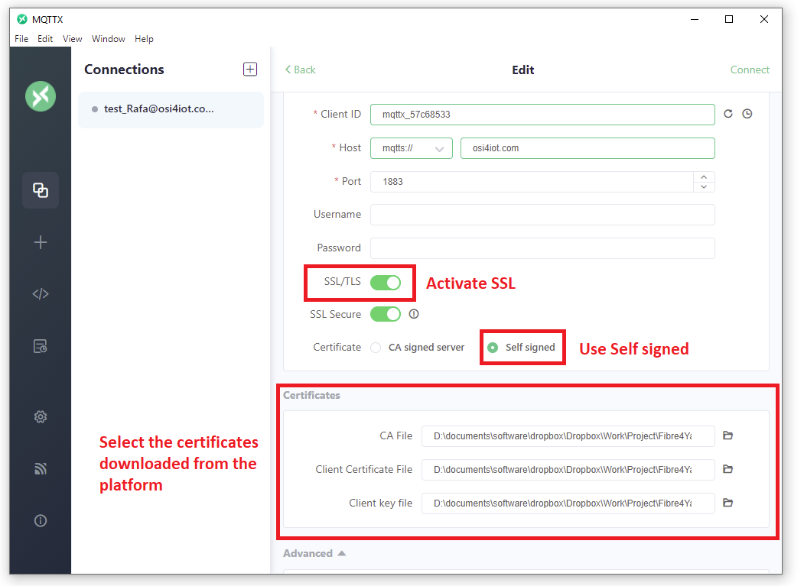
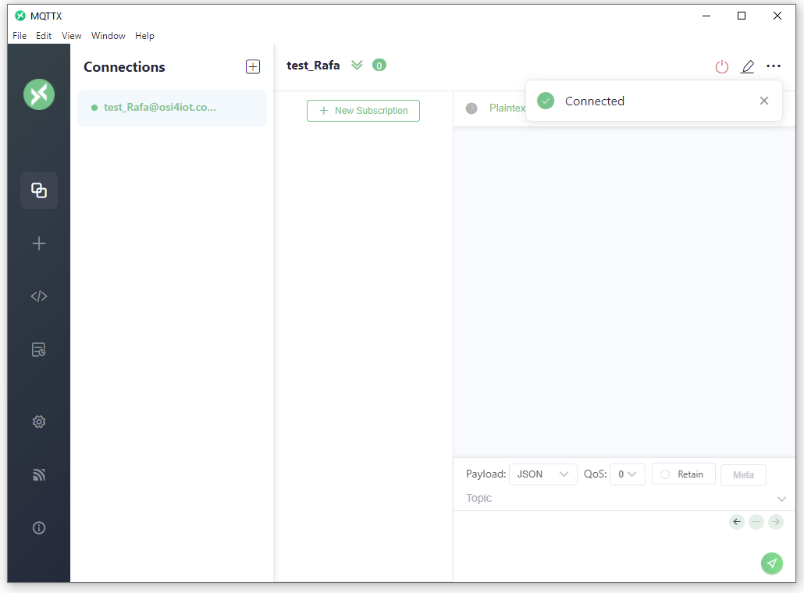
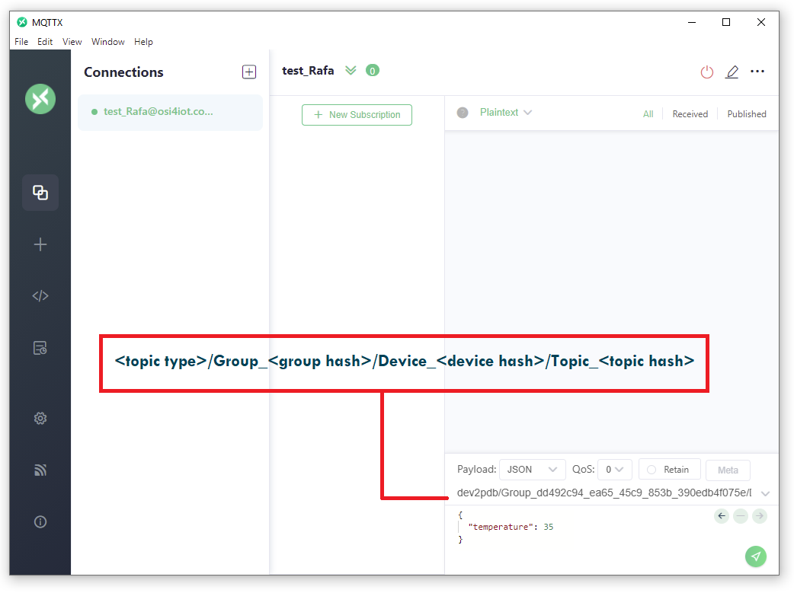
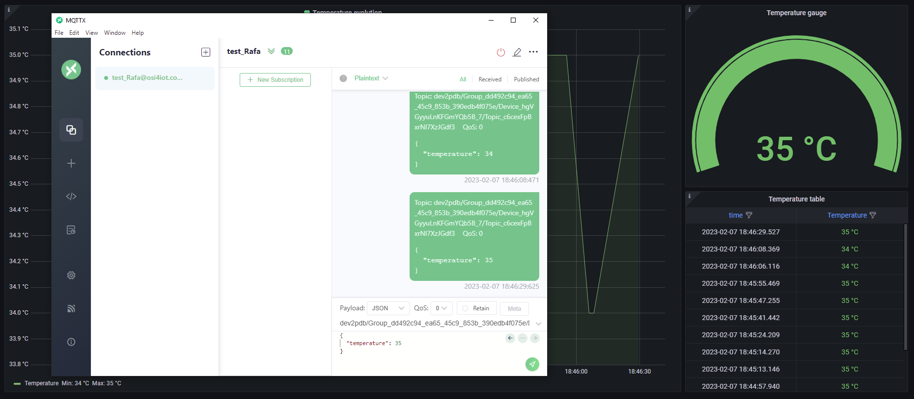

# MQTTX

.

`MQQTX` is a cross-platform MQTT 5.0 desktop client available to test the MQTT API in the platform. 

Assuming that you have set up correctly the platform, generated a `group`, a `device` and a `topic`. The first step is to connect to the `topic`.

## Connecting

In the MQQTX click on the pencil icon on the top right of the window to edit the session.

You need to specify the direction to your host the protocol that is `mqtt://` and the domain where your platform is being hosted. Also you are required to use your user credentials (username and password used to access the platform).

Otherwise, avoid using the user credentials by downloading the `SSL certs` in the device tab of the platform and activate the `SSL/TLS` option, select `Self signed` and select the three certificates that you have downloaded for the `device` (`ca.crt`, `*.crt` and `*.key`).

## Subscribing or Publishing information

Once you have configured the session, click on `Connect`. A message like the one below should appear if you connected correctly.

If you want to send information to the platform using the topic type `dev2pdb` (device to platform database), you will need to gather:

- topic type : `dev2pdb`
- group hash :  found in the `Groups managed` tab.
- device hash : found in the `Devices` tab.
- topic hash : found in the `Topics` tab.

and use the following format:

    <topic type>/Group_<group hash>/Device_<device hash>/Topic_<topic hash>

To insert that in the payload (see image below).

Then you can modify the payload:

    {
        "temperature": 35
    }

And click the send button. You will be able to see that, in real time, the platform updates the values for the modified `topic`.

