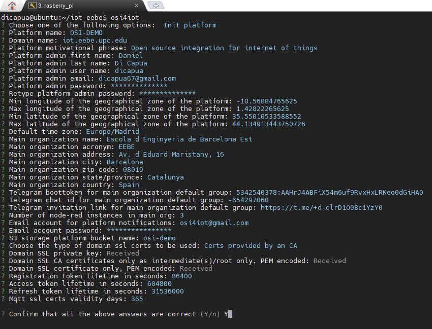

# SSL Certificates

Options available:

1. No Certs:

    The simplest, run the platform without domain SSL certification.
2. Certs provided by a CA:

    In this case, you will need to request the certificates to a Certificate Authority (CA).
3. Let’s encrypt certs and AWS Route 53:

    The generation in this case is automatic but the Route 53 is a paid service.
4. AWS Certificate Manager:

    This option is used when deploying the platform on an AWS cluster.

## No certs
Selecting the option 

    No certs

Fill the required fields

    ? Choose the type of domain ssl certs to be used: No certs
    ? Registration token lifetime in seconds: 86400
    ? Access token lifetime in seconds: 604800
    ? Refresh token lifetime in seconds: 31536000
    ? Mqtt ssl certs validity days: 365

    ? Confirm that all the above answers are correct (Y/n)

You can use the default values inside the parenthesis by pressing enter. Finally if everything is correct, type 

    Y

and the platform will be installed.

## Certs provided by a CA

If instead the option of provided by a Certification Authority (CA) is selected. Then you need to provide the `SSL private key`, `SSL CA certificate` and `SSL certificate` as shown in the image below.

