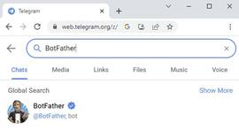
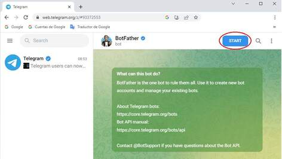
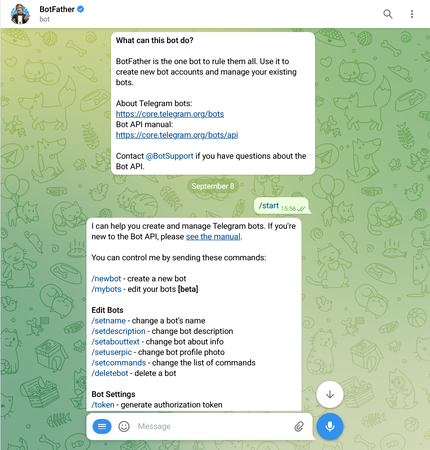
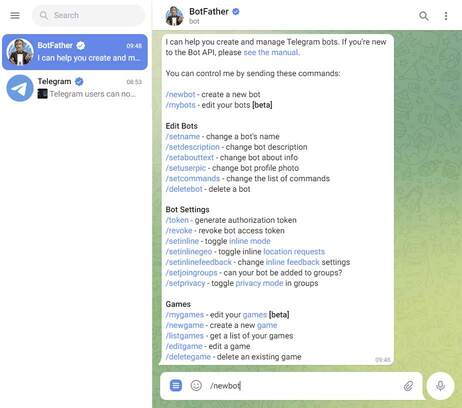
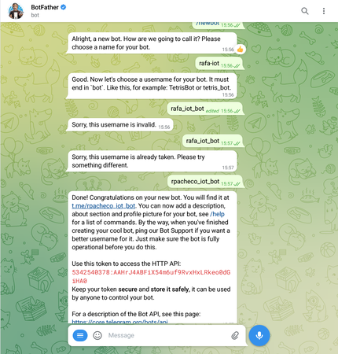
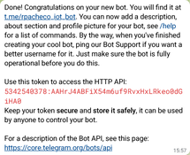
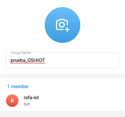
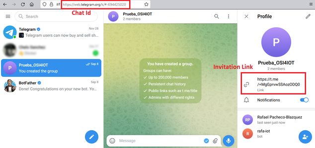
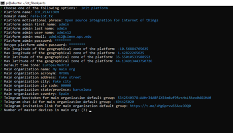

# Telegram Bot

To create a telegram bot notification system, you need to adquire these 3 following things.

-	Telegram bot token.
-	Group id of Telegram for main organization default group.
-	Telegram invitation link for main organization default group.

One of the simplest ways to create a bot is using the BotFather's telegram application. Search the bot by typing `BotFather` in the telegram search bar.

Or visit the following link https://telegram.me/botfather and click send message.

Then to start creating a bot by typing `/start` in the conversation or click the start button.

To create a bot use	`/newbot`

Then complete the Botfather form.

Once completed you should receive a similar message to this. In here you will obtain the `bot token`.

Then create a new group.

Then it will allow you to add members. Remember that when the bot was created it provides you a link to send a message to it. Here the username will be shown with an @ at the beginning of the username.

Add the bot.

Name the group.

If you succeeded in creating the group. Now you can obtain the `chat id` and the `telegram invitation link`. The `chat id` can be obtained from the id after the last *#* in the URL displayed in the browser. The `telegram invitation link` will be given in the profile information. 

In this example, the `bot token`, `chat id` and `telegram invitation link` where.

* Bot token: **5342540378:AAHrJ4ABFiX54m6uf9RvxHxLRKeo0dGiHA0**
* Chat id: **-694425020**
* Invitation Url: **https://t.me/+MgGprvw5SAozODq0**

Save the `bot token`, `chat id` and `telegram invitation link` to later be inputed in the Command Line Interface (CLI) of the platform when being initializing.

 
